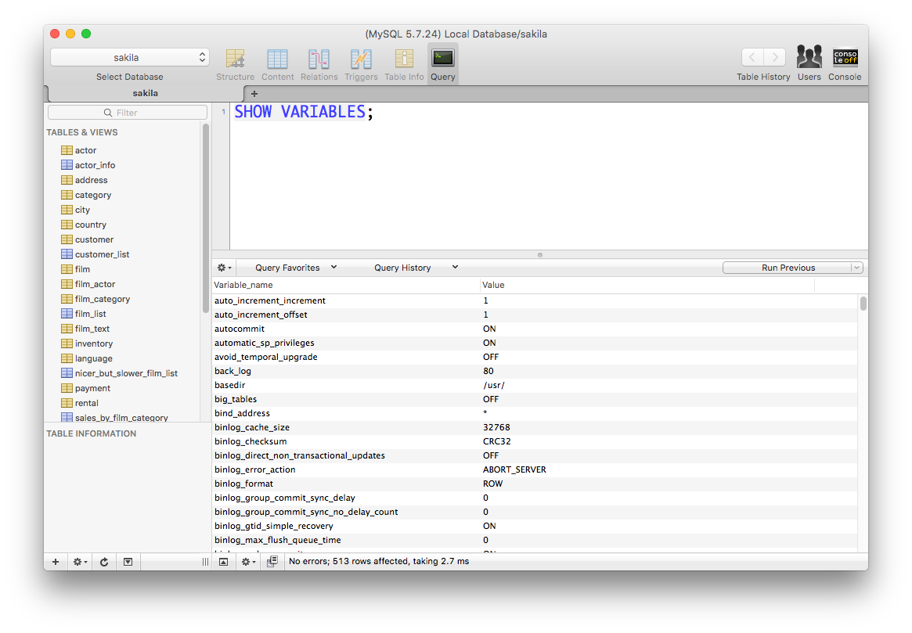
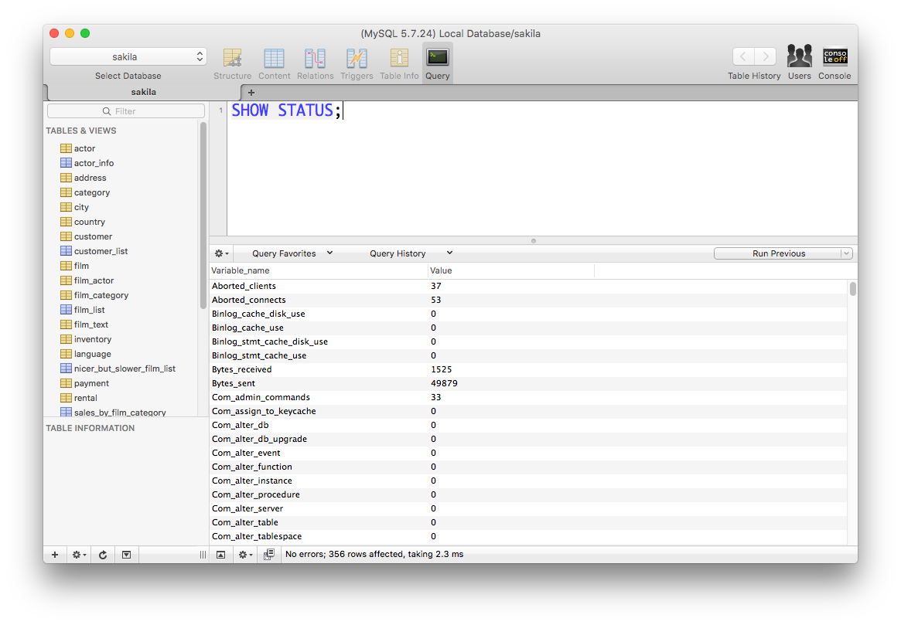

> 특정 값만 확인하기 위해서는 ```like``` 명령어를 같이 사용하면 됩니다.

## MySQL 환경변수 설정 확인
MySQL System 변수 값을 확인하기 위해서는 ```show variables``` 명령어를 사용합니다. 상세한 정보는 [공식 문서](https://dev.mysql.com/doc/refman/8.0/en/show-variables.html)를 참고하시면 됩니다.

```sql
SHOW VARIABLES;
```



## MySQL 상태 확인
MySQL 서버 상태 정보를 확인하기 위해서는 ```show status``` 명령어를 사용합니다. 상세한 정보는 [공식 문서](https://dev.mysql.com/doc/refman/8.0/en/show-status.html)를 참고하시면 됩니다.

```sql
SHOW STATUS;
```

