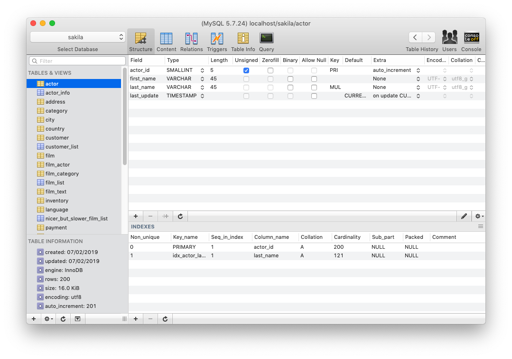
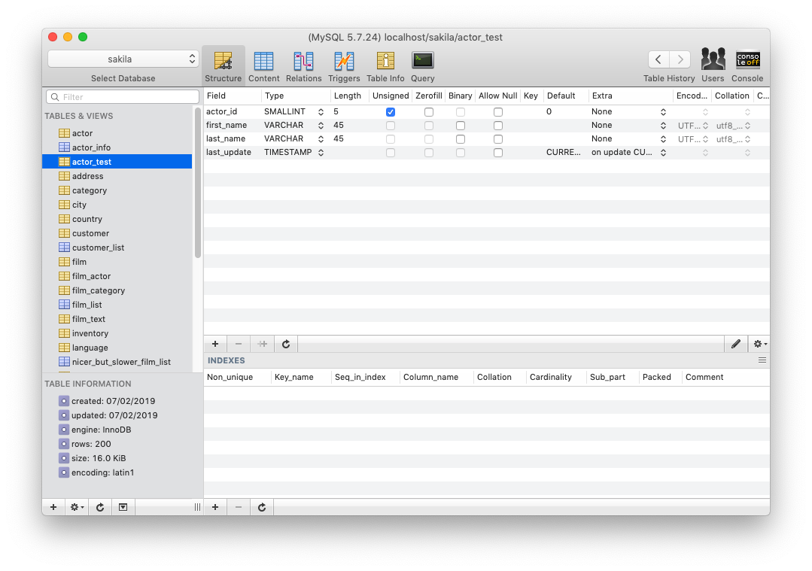
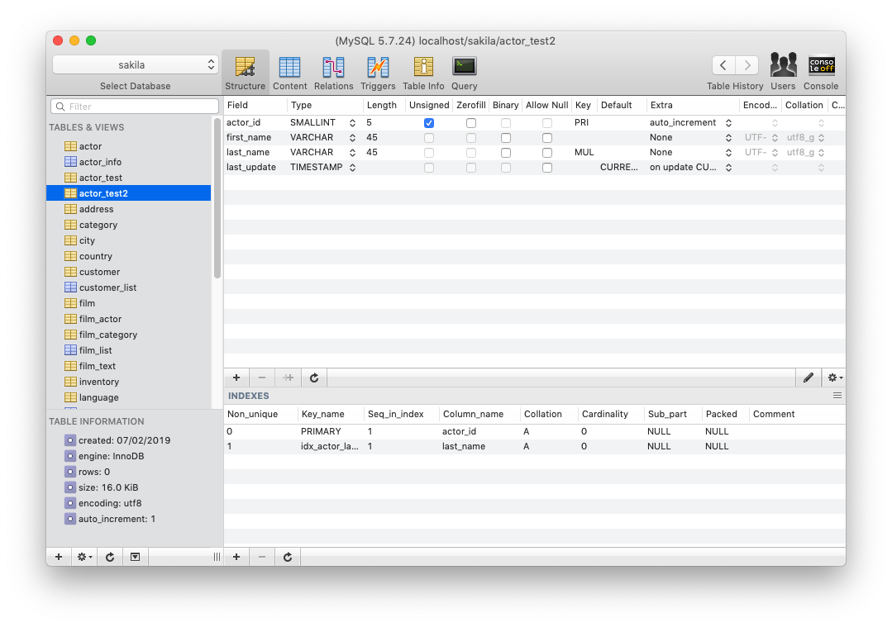

> MySQL 데이터베이스에서 제약조건을 포함하여 테이블을 복사하는 방법에 대해 알아보겠습니다. 예제에서 사용되는 테이블은 MySQL 샘플 데이터베이스 sakila에 있습니다. sakila 샘플 데이터베이스는 [Github](https://github.com/datacharmer/test_db)에서 받을 수 있습니다.

## 테이블 구조 살펴보기
sakila 데이터베이스의 actor 테이블 구조를 간단하게 살펴보겠습니다. ```actor_id 컬럼```이 테이블의 ```Primary Key```이며, auto_increment 설정이 되어 있습니다.

그리고 컬럼은 ```actor_id``` , ```first_name```, ```last_name```, ```last_update``` 4개로 구성되어 있습니다.



## CTAS로 테이블 복사하기
```CTAS(create table as select)``` 구문을 사용해서 ```actor``` 테이블을 복사하겠습니다. SQL를 실행하고 나서 ```actor_test``` 테이블 구조를 살펴보면, <b>제약조건이 포함되지 않은 상태로 복사</b>가 된 것을 확인할 수 있습니다.

```sql
CREATE TABLE actor_test AS
SELECT * FROM actor;
```



## 제약조건 포함해서 테이블 복사하기
테이블의 컬럼 형태만 보존하고 데이터를 복사해야 하는 경우라면, 이전에 살펴본 CTAS 구문을 사용해도 무방합니다. 하지만, <b>테이블에 정의된 컬럼 속성과 인덱스 정보를 포함해서 복사</b>해야 한다면 다음과 같은 SQL를 실행해야 합니다.

```sql
CREATE TABLE actor_test2 LIKE actor;
```



<br/>

```CREATE TABLE … LIKE``` 문법을 이용하면, <b>테이블 구조만 복사되고 데이터는 복사되지 않습니다.</b> 데이터 복사까지 해야한다면, ```INSERT``` 구문을 이용하여 따로 데이터를 복사해야 합니다.

```sql
-- 데이터 복사
INSERT INTO actor_test2 SELECT * FROM actor;
```

## 참고자료
- https://dev.mysql.com/doc/refman/5.7/en/create-table-like.html