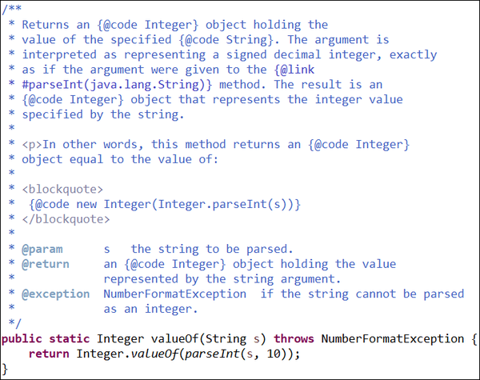

Integer 클래스에는 ```valueOf```, ```parseInt``` 메서드가 있습니다. 이 두 메서드는 매개 변수로 전달 받은 문자열(String) 값을 정수 형태로 반환합니다. 메서드 시그니처를 살펴보면, <b>두 메서드의 차이는 리턴 타입</b>이 다릅니다.

## valueOf 메서드
```valueOf``` 메서드는 ```Integer``` 객체를 반환합니다. 그리고 내부적으로 ```parseInt``` 메서드를 사용합니다.

```java
public static Integer valueOf(String s) throws NumberFormatException {
    return Integer.valueOf(parseInt(s, 10));
}
```



## parseInt 메서드
```parseInt``` 메서드는 기본 자료형 ```int```를 반환합니다. 오버로딩 메서드 내부적으로 ```parseInt(s, 10)``` 메서드를 호출하는데, ```10은 진수형태```를 나타냅니다. 기본값이 10이므로 10진수의 형태로 변환합니다.

```java
public static int parseInt(String s) throws NumberFormatException {
    return parseInt(s, 10);
}
```