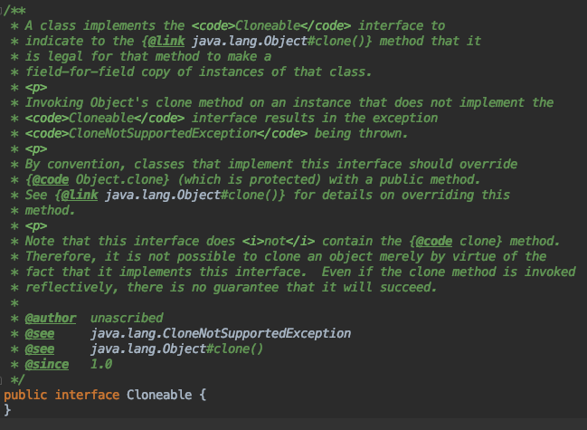

> Effective Java 3판을 학습하며 요약한 내용입니다. 자세한 내용은 책을 참고해주시기 바랍니다.

## Clonable 인터페이스
```Cloneable```은 어떤 객체가 복제(clone)을 허용한다는 사실을 알리기 위해서 만들어진 믹스인 인터페이스이다. 인터페이스 내부를 살펴보면 clone 메서드가 선언되어 있지 않고, Object 클래스에 clone 메서드가 protected로 선언되어 있다.



Cloneable 인터페이스는 Object 클래스의 clone 메서드가 어떻게 동작할 것인지에 대해 결정한다. Cloneable을 구현한 클래스의 인스턴스에서 clone을 호출하면, 해당 객체를 필드 단위로 복사한 객체를 반환한다. 반대로 Cloneable을 구현하지 않으면, CloneNotSupportedException 예외를 던진다.

## Cloneable 인터페이스 구현하기
Cloneable 인터페이스를 구현한 User 클래스를 다음과 같이 생성한다.

```java
public class User implements Cloneable {

    private String name;

    public User(String name) {
        this.name = name;
    }

    public String getName() {
        return name;
    }

    public void setName(String name) {
        this.name = name;
    }

    @Override
    public User clone() throws CloneNotSupportedException {
        return (User) super.clone();
    }
}
```

 Object 클래스의 clone 메서드의 제한자는 protected이기 때문에 public으로 재정의해야 한다. 그렇지 않으면 다른 클래스에서 clone 메서드를 호출할 수 없다. 반환하는 타입은 User로 변경된 것을 확인할 수 있다. 이는 자바가 공변 변환 타이핑을 지원하기 때문이다. 재정의한 메서드의 반환 타입은 상위 클래스의 메서드가 반환하는 타입의 하위 타입일 수 있다.

User 클래스의 객체를 생성하고, 인스턴스를 통해 clone 메서드를 호출해보자. 정상적으로 복제가 되었다면 두 개의 객체는 같은 이름을 가져야한다. 테스트 코드를 돌려보면 두 객체의 값은 동일하기 때문에 통과한다.

```java
User user = new User("jayden-lee");
User user2 = (User) user.clone();
Assert.assertEquals(user.getName(), user2.getName());
```

## 가변 객체가 포함된 객체 복사는 조심해야 한다
가변 객체가 포함된 클래스를 복사하는 경우에는 ```super.clone()``` 결과를 그대로 반환하면 예상치 못한 곳에서 오류가 발생할 수 있다. User 클래스에 가변 객체를 추가하고 clone 메서드를 호출해보면 쉽게 알 수 있다.

User 클래스에 List<String> 필드를 추가한다. 복제된 User 인스턴스에서 가변 객체의 값을 변경하면, 원본 객체도 동일하게 변경된다.

아래 코드를 실행시키면, ```Assert.assertEquals(1, user.getFriendNames().size())```에서 기대한 값과 다른 값이 반환되어 실패한다.

```java
User user = new User("jayden-lee");
user.addFriendName("ella");

User user2 = (User) user.clone();
user2.addFriendName("wedul");

Assert.assertEquals(1, user.getFriendNames().size());
Assert.assertEquals(2, user2.getFriendNames().size());
System.out.println(user.getFriendNames());
System.out.println(user2.getFriendNames());
```

원본과 복제본 객체는 동일한 가변 객체를 참조하고 있기 때문에 어느 한 곳에서 수정이 일어나면 다른 곳도 영향을 받게 된다. 이처럼 가변 객체가 포함되어 있는 객체를 복사시에는 조심해야 한다.

clone 메서드는 생성자의 또 다른 종류이기도 하다. 복제된 객체는 원본 객체에 피해를 주면 안되며, 클래스의 불변 규칙을 지켜야 한다.

> Cloneable 인터페이스를 구현한 클래스는 clone 메서드를 public 제한자로 반드시 재정의해야 한다. 반환 타입은 Object가 아닌 클래스 자신으로 변경한다. super.clone 메서드를 호출하고 나서 가변 객체도 복제가 될 수 있도록 로직을 추가한다.

## 복사 생성자와 복사 팩터리 방법
Cloneable 인터페이스를 구현한 클래스는 clone 메서드를 반드시 구현해야 한다. 객체를 복제하는 방법에는 Cloneable 인터페이스를 구현하는 것 말고도 복사 생성자와 복사 팩터리 방법이 있다.

복사 생성자는 자신과 같은 클래스의 인스턴스를 받는 생성자를 말한다. 복사 팩터리는 [아이템1](https://jayden-lee.tech/java/effective-java-item1)에서 봤던 것과 동일하게 복사 생성자를 모방한 방식이다.

이를 이용하면 원본 구현 타입에 얽매이지 않고 복제본 타입을 직접 선택할 수 있다. 예를 들어 HashSet 객체를 생성한 다음에 TreeSet 변환 생성자에 매개변수로 전달하면, TreeSet 타입의 객체로 변환하여 복제할 수 있다.

```java
Set<String> set = new HashSet<>();
Set<String> treeSet = new TreeSet(set);
```