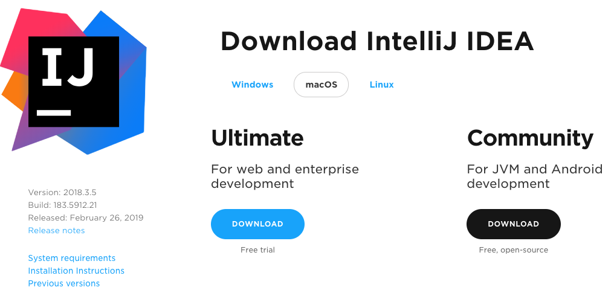
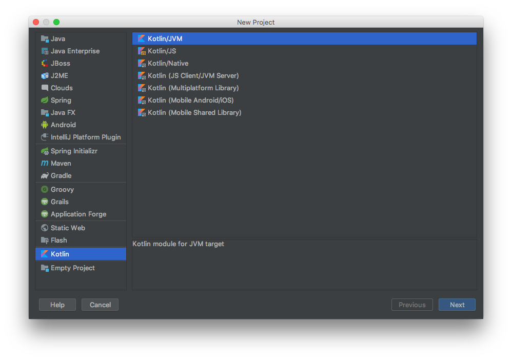
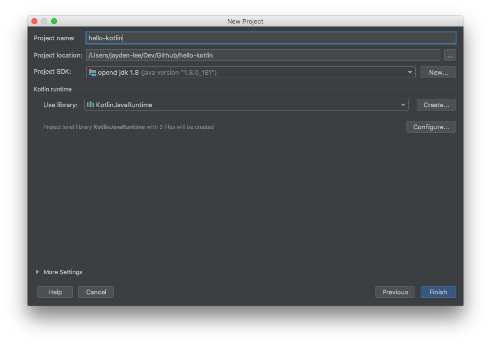
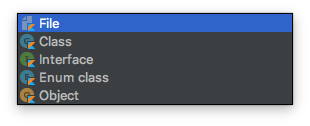
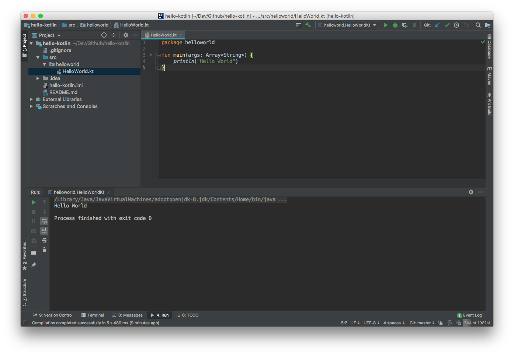

## Java 개발자인데 Kotlin을 배우려는 이유?
[KCD 2019](https://kcd2019.festa.io/) 세미나에서 "구글이 선택한 코틀린? 왜 좋을까?"라는 세션을 듣고 나서 ```Kotlin``` 언어에 대해 
관심을 갖게 되었습니다. 아마도 JVM 기반 언어이면서 <b>Kotlin이 Java와 100% 호환성 지원</b>이 된다는 사실에 끌렸던 것 같습니다.

마침 현재 진행하는 프로젝트에서도 특정 처리에 대해서 ```Kotlin```으로 처리하고 있었습니다. 그렇기 때문에 ```Java```로 작성된 코드를 ```Kotlin```으로
변경해보면서 익히면 자연스럽게 배울 수 있다는 생각이 들었습니다. 참고로 IntelliJ IDEA에는 [Java 코드를 Kotlin 코드로 변경해주는 기능](https://www.jetbrains.com/help/idea/converting-a-java-file-to-kotlin-file.html)이 있습니다.

다시 생각해봐도 <b>Kotlin을 배우고자 했던 큰 이유는 단순한 호기심</b> 때문인 것 같습니다 😊

하지만 안드로이드 개발자 입장에서는 Kotlin을 배우는 것이 개발하는데 많은 이점을 가져다 줄 것으로 생각됩니다. 이에 대한 자세한 내용은 KCD 발표자료 중 ["안드로이드의 한계"](https://speakerdeck.com/taehwandev/korea-community-day-2019?slide=10)에서 확인해주세요!

## Kotlin 특징
Kotlin은 Java 개발자들이 많이 사용하고 있는 IntelliJ IDEA를 만든 JetBrains이 개발한 프로그래밍 언어입니다. 구글이 2017년 공식
안드로이드 개발 언어로 채택했다는 사실은 그 자체만으로도 영향력이 크다고 볼 수 있습니다. Kotlin은 Java와 마찬가지로 JVM에서 동작 가능한 애플리케이션을
만들 수 있습니다. ```Kotlin Native```는 안드로이드 개발뿐만 아니라 iOS, MacOS, Windows 등 다양한 플랫폼에서 개발이 가능합니다.

<br/>

- JetBrains 2011년 공개한 프로그래밍 언어
- JVM 기반 언어이며 Java와 상호 호환 100% 지원
- 안전한 null 처리
- 확장 함수, 연산자 오버 로딩
- DSL(domain-specific languages)
- coroutines
- 객체지향 프로그래밍과 함수형 프로그래밍
- 간결한 코드 작성
- ...

<br/>

> Kotlin 특징에 대한 자세한 내용은 차차 포스팅을 하나씩 하면서 알아보도록 하겠습니다.

## Kotlin 개발환경 구축
새로운 프로그래밍 언어나 프레임워크를 배우게 되면 언제나 거쳐야 하는 단계는 바로 <b>"개발환경 구축"</b> 입니다. Kotlin 개발을 지원하는 툴은 ```IntelliJ IDEA```, ```Eclipse``` 등에서
지원하고 있지만, 이번 글에서는 IntelliJ IDEA를 사용하도록 하겠습니다.

### IntelliJ IDEA 설치
IntelliJ IDEA는 [JetBrains 홈페이지](https://www.jetbrains.com/)에서 다운로드 받을 수 있습니다. 다운로드 페이지에 가면 ```Ultimate```와 ```Community``` 버전을
확인 할 수 있습니다. Community 버전을 사용해도 무방하지만, *대학생이시라면 학교 메일 계정을 통해 Ultimate 버전을 사용하는 것을 추천드립니다.*

<br/>



<br/>

### JDK 설치
Kotlin을 개발하기 위해서는 반드시 ```SDK```가 필요합니다. 기존에 Java를 사용했다면, JDK 경로를 설정하시면 됩니다. 그리고 기존에 Oracle JDK를 사용하신 분 또는 새로 JDK를 설치해야
한다면, [AdoptOpenJDK](https://adoptopenjdk.net/)를 사용해보시는 것을 추천드립니다. 

## Kotlin/JVM 프로젝트 생성
IntelliJ IDEA를 실행하고 나서 ```+ Create New Project```을 클릭합니다. 그리고 왼쪽 카테고리에서 Kotlin을 선택합니다. 그리고 ```Kotlin/JVM``` 모듈을 선택하고 오른쪽 하단에 있는
```Next``` 버튼을 클릭합니다.



프로젝트 이름, 경로, SDK를 설정하고 나서 ```Finish``` 버튼을 클릭하고 나면, <b>첫 번째 Kotlin 프로젝트가 생성</b> 됩니다 🎉


## Kotlin "Hello World" 예제 작성
앞에서 Kotlin 개발하기 위한 IDEA도 설치하고, 프로젝트 생성을 진행했습니다. 프로그래밍 언어를 배울 때 가장 먼저 작성해보는 "Hello World" 예제를
Kotlin에서는 어떻게 구현하는지 알아보도록 하겠습니다.

### HelloWorld.kt 파일 생성
Java와 동일하게 Kotlin으로 작성된 코드는 package로 구분할 수 있습니다. ```helloworld``` package를 생성하고, 해당 패키지 내에 ```HelloWorld.kt``` 파일을 새로 생성합니다.
어색할 수 있지만 Kotlin 파일 확장자는 ```.kt```입니다.

```HelloWorld``` 파일을 생성하면 당황할 수 있습니다. 파일 내에 package 이름만 있고 Java에서 흔히 볼 수 있는 클래스 이름이 따로 정의되어 있지 않습니다.

```kotlin
package helloworld
```

<br/>

그 이유는 바로 파일을 생성할 때 종류를 ```File```로 지정했기 때문입니다. 



<br/>

파일의 종류를 ```Class```로 변경하면, Java에서 봤던 것처럼 다음과 같은 코드로 파일이 생성됩니다.

```kotlin
package helloworld

class HelloWorld {
}
```

<br/>

### main 함수 작성
Java 프로그램에서는 작성된 코드가 실행되기 위한 진입점이 정적 main 메서드(```public static void main(String[] args)```)라는 것은 Java 개발을 경험해봤다면 대부분 알고 있습니다. 이처럼 Kotlin에서도 main 함수가 있습니다.

이제 HelloWorld.kt 파일을 열어서 "Hello World" 문자열을 출력할 수 있도록 main 함수를 아래와 같이 작성합니다.

```kotlin
package helloworld

fun main(args: Array<String>) {
    println("Hello World")
}
```

코드를 모두 작성하고 나서 프로그램을 실행하면 "Hello World" 문자열이 출력됩니다.



</br>

<hr>

HelloWorld 예제를 작성해보면서 Java 함수와 Kotlin 함수의 형태가 다르다는 것을 알 수 있었습니다. 아래 코드는 Java와 Kotlin에서
함수를 작성하는 문법을 나타낸 것입니다.

<b>Java 함수</b>
```java
[접근자] ReturnType 함수명(Type 변수들) {
    [return]
}
```

<b>Kotlin 함수</b>
```kotlin
[접근자] fun 함수명(변수들: Type): ReturnType {
    [return]
}
```

### Java와 Kotlin 함수 차이점

1. 함수의 접근자로 Java는 ```public```/```private```/```protected``` 3가지 형태가 올 수 있지만, Kotlin은
```private```/```protected``` 2가지만 가능합니다.

2. Return Type 위치가 Java는 함수명 앞에 있는데 반해 Kotlin은 함수명 뒤에 위치합니다.

3. Java는 파라미터 타입과 이름 순서대로 작성하지만, Kotlin은 파라미터 이름이 먼저 오고 타입이 뒤에 위치합니다.

## 참고자료
- [Korea Community Day 2019 Taehwan님 발표자료](https://speakerdeck.com/taehwandev/korea-community-day-2019)